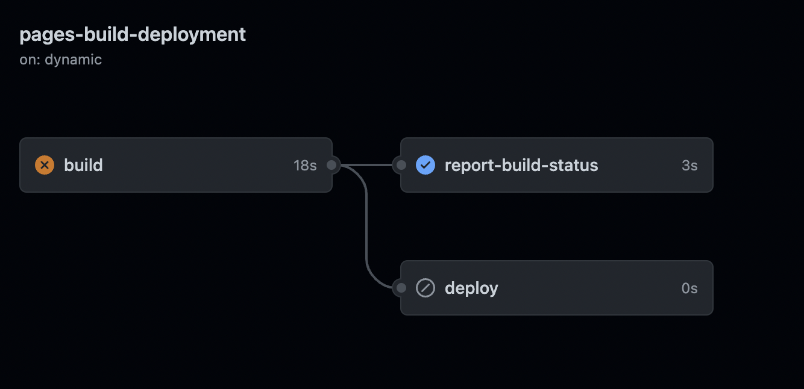

# GIT ERRORS AND SOLUTIONS

## Deployment and Submodules
<section>
### Context:
While github actions deploys a project which has nested folders with `.git`.

#### Symptoms:
- the deployment using git-page is not updating the last added changes
- no errors in terminal while pushing

#### How to Debug:
- check the repository `actions` tab to check all the job done by the github actions
	` github.com > select the project repository > click on "Actions" tab"`
- checking the failing job / run
	`select the failing workflow "pages build and deployment" > in the graph select "build"`
	
- "Annotations" stating 
	- `The process '/usr/bin/git' failed with exit code 128` 
	- and `No url found for submodule path <folder-with-identified-submodule>' in .gitmodules`
- checking the path and observing that the folder has an arrow symbol

#### How to fix
- Remove the hidden `.git` repository in the folder
- If after a new "push" it is not sufficient: 
	- `git rm --cached <folder-with-identified-submodule>`
	- `git add <folder-with-identified-submodule>`
	- Then commit and "push" again: the pipelines should be all good

